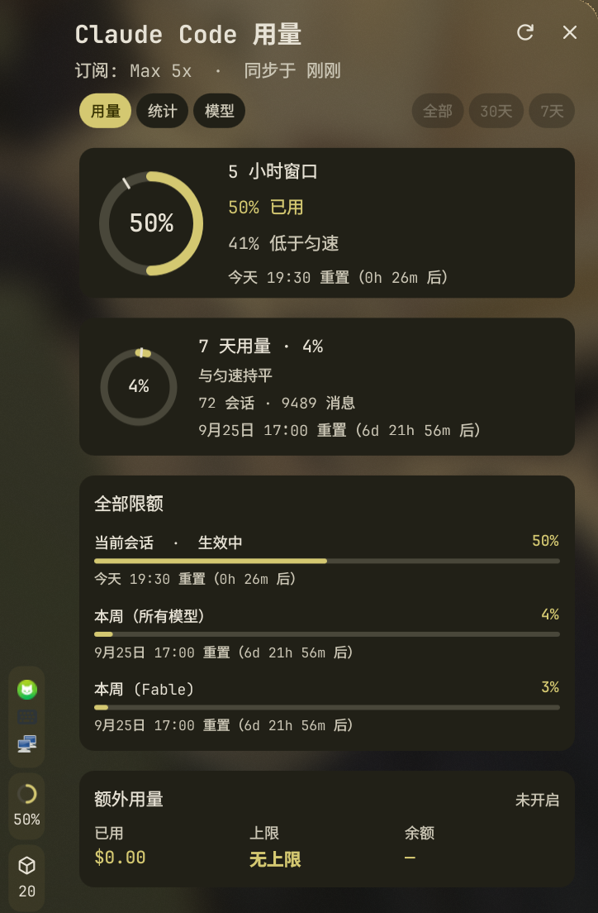

# Claude Usage

A trimmed-down [DMS](https://github.com/AvengeMedia/DankMaterialShell) bar widget for Claude Code usage, based on [titeya/dms-claudecode](https://github.com/titeya/dms-claudecode).



- **The network is only used for `/usage`.** The `/api/oauth/usage` limits are fetched when you click the refresh button in the popout header, or on a schedule if you enable one (see Configuration). The result is cached in `~/.cache/canary-claude-usage/usage.json`, so the last synced values survive a restart.
- **Everything else is offline.** Local transcripts under `~/.claude/projects/**/*.jsonl` are scanned on startup and each time the popout opens.

The popout has three tabs. The tabs and the time range (All / 30d / 7d) sit on the same row; scroll the wheel over that row to switch tabs.

- **Usage (`/usage`)**: 5h / 7d rings with a pacing marker, every limit in `limits` (including per-model weekly limits and which one is active) with its reset time, and extra usage (credits used, limit, balance). The API also returns some internal codename fields (such as `nimbus_quill`). Their meaning is unknown, so they are not shown.
- **Stats (`/stats` overview)**: a GitHub-style heatmap, favorite model, total tokens, sessions, longest session, current / longest streak, active days, peak hour, most active day, messages by hour, and today / this week / this month.
- **Models (`/stats` models)**: a daily tokens line chart with one line per model, a share donut, and input / output / cache read / cache write / messages for the hovered model (or all models combined).

## Configuration

DMS Settings > Plugins > Claude Usage:

| Setting | Default | Notes |
|---|---|---|
| /usage sync frequency | Manual only | Manual only, or every 5 / 10 / 15 / 30 / 60 min. The interval is measured from the last attempt, so a failing endpoint is not retried every minute. Catches up right after resume from sleep. |
| Sync when opening the popout | Off | At most once a minute. |
| Bar shows | 5h window % | 5h %, 7-day %, or today's tokens (local, always current). |
| Show pacing | On | Pace tick on the rings, plus the ↑ in the bar. |
| Tab on open / Range on open | Keep last | Reset to a fixed tab / range each time the popout opens. |
| Week starts on | Monday | Heatmap columns and this week's figures. |
| Heatmap colors by | Tokens | Tokens or messages. |
| Claude config directory | `~/.claude` | Same as `CLAUDE_CONFIG_DIR`, for a second account. Each directory gets its own cache under `~/.cache/canary-claude-usage/profiles/`. |

## Changes from the original plugin

- Removed: always-on automatic refresh (now opt-in), multi-profile support (CCS / ccp / custom), LiteLLM cost estimates, and the exchange-rate lookup.
- The backend is now a Python 3 standard-library script. It no longer needs `jq` or `curl`.
- Messages are de-duplicated by `message.id + requestId`. The original counted every streamed chunk, so its totals came out about 1.8× too high.
- The scan cache is incremental: a file is rescanned only when its size or mtime changes. Stats for transcripts that Claude Code has deleted (`cleanupPeriodDays`) are kept, so heatmap history is not lost.
- If the OAuth token has expired, the plugin does not refresh it (refreshing would rotate Claude Code's own refresh token). Run `claude` once, then click refresh again.

## Installation

```bash
git clone https://github.com/HotcocoaCanary/Canary-DMS-Plugins.git
ln -s "$PWD/Canary-DMS-Plugins/ClaudeUsage" ~/.config/DankMaterialShell/plugins/canaryClaudeUsage
dms ipc call plugin-scan scan
dms ipc call plugins enable canaryClaudeUsage
```

Then add `canaryClaudeUsage` to the bar under DMS Settings > Bar.

## Debugging

```bash
./claude-usage.py          # offline output as JSON
./claude-usage.py --sync   # also request /usage once
```

## License

MIT (includes the original author's copyright notice)
